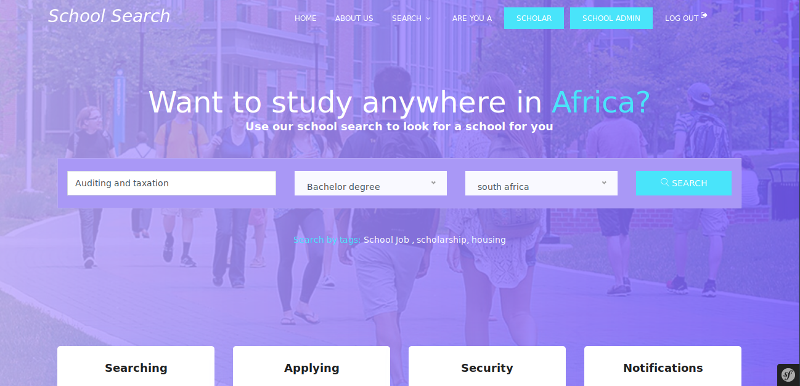
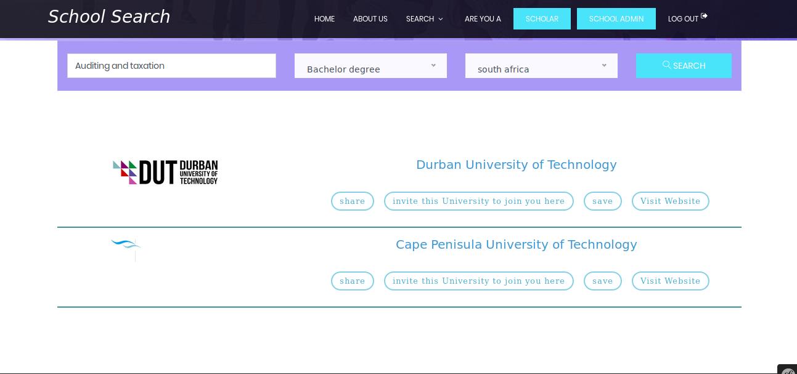

University Search Engine

This project was developt as my final year project in 2019 during my bachelor degree program
========================

[1] Abstract:

Students who complete secondary education have a need to search for suitable universities to
continue their studies. Once admission to their desired university has been obtained,
accommodation may also be needed. This is often challenging due to the lack of information.
To address this gap a data collection process from some selected university websites was done.
The process makes use of a web crawler which is an automated bot that moves on the web to
extract information from websites. This was followed by a data presentation to end-users in
texts, images, videos formats and an interface of communication was put in place to establish
and maintain communication between scholars and Universities of interest. Finally,
accommodation securement around universities where admission has been obtained was done.
The prototyping model was used to help critically examine the technical issues associated
with the search engine development until efcient, scalable algorithms have been produced.
The results obtained from the search engine are 70% close to the expected results. These results
indicate that, the web crawler needs to be optimized for the search engine to be fully functional.

[2] Project aim and objectives:

The aim of this search engine is to build a network between Scholars and Universities through a
web crawler and to enable scholars to secure accommodation around universities where
admission has been obtained.
The objectives of the project are:
 Data collection from university websites by the use of a web crawler
 Data presentation to end-users
 Communication establishment and maintenance between Scholars and Universities
 Accommodation securement around university where admission has been obtained

[2] Scopes or limitation:

The search engine is build to work for the following countriesin africa: Senegal,South Africa, cameroon, Ivory coast.
However, the project can be scale in the future to extend the number of users by taking into
consideration that Africa continent is our target.

[3] Search page:

[4] Result page:

